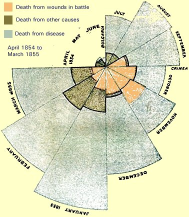
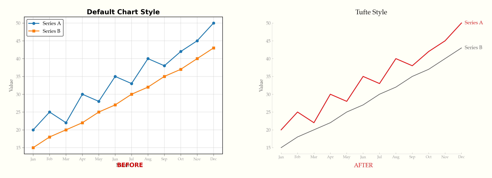

# Introduction

## Learning goals of today

-   Short repetition from last week
-   Crash course in data visualisation
-   Intro to ggplot

## Repetition: Useful commands

-   group_by(): Grouping by variable (for manipulation)
-   join(): Join two data sets on identifier
-   arrange(): Sort all data by variable(s)
-   pivot(): Re-order data beween rows and columns

# Data visualisation

## Why is data visualisation so important?

-   There is an abundance of data
-   But all the data in the world is meaningless if it is not understood
-   Humans are visual creatures
-   Data visualisation is the fastest way for humans to digest complex data

## Famous people in data viz: Florence Nightingale

-   Florence Nightingale
-   Manager and nurse educator in the British Army
-   Became famous for data visualisation of Crimean War

## British Casualties in 1854

{fig-align="left" height=250}

## Famous people in data viz: Edward Tufte

- American Statistician
- [The Visual Display of Quantitative Information](https://www.edwardtufte.com/book/the-visual-display-of-quantitative-information/)
- Famous for data visualisation principles

## Some of Tufte's principles for good data vis

-   Show the data
-   Maximize data-ink ratio
- Minimizing chartjunk
- Graphical integrity

## An example of Tufte's principles

{fig-align="left" height=250}

Source: https://raw.githubusercontent.com/caylent/tufte-data-viz/main/_docs/before-after.png


## Some further reading

- [Data visualization in R](https://r4ds.hadley.nz/data-visualize.html)
- [R Graph Gallery](https://r-graph-gallery.com/)
- [Modern Data Visualization with R](https://rkabacoff.github.io/datavis/index.html)
- [Data Visualization in R](https://www.geeksforgeeks.org/r-language/data-visualization-in-r/) (Geeks for Geeks)

# ggplot()

## Introduction to ggplot()

- ggplot() is the tidyverse function for creating graphs
- It is very versatile and provides many options
- load using library("ggplot2")

## Basic components of ggplot() function


- call function: ggplot(...
- add data: data = ...
- add aesthetics aes(x = ... , y = ... , color = ...)
- add layer that you want to visualise, like points + geom_point()


## Simple example of ggplot() - Code

```{r}
# Load ggplot2
library(ggplot2)

# Scatterplot using iris data set
ggplot(data = iris,
       aes(x = Sepal.Length,
           y = Sepal.Width,
           colour = Species)) +
  geom_point()

```
## Simple example of ggplot() - Graph

```{r}
#| echo: FALSE
#| eval: TRUE
#| height: 8

# Load ggplot2
library(ggplot2)

# Scatterplot using iris data set
ggplot(data = iris,
       aes(x = Sepal.Length,
           y = Sepal.Width,
           colour = Species)) +
  geom_point()

```


## Task: Simple scatter plot with your data

- Try to create two simple scatter plot in your data using ggplot()

```{r}
# Load ggplot2
library(ggplot2)

# Scatterplot using iris data set
ggplot(data = iris,
       aes(x = Sepal.Length,
           y = Sepal.Width,
           colour = Species)) +
  geom_point()

```

## Simple example of ggplot() - Alternative code

```{r}
# Load ggplot2
library(ggplot2)

# Boxplot using iris data set
ggplot(data = iris,
       aes(x = Sepal.Length,
           color = Species)) +
  geom_boxplot()

```
## Simple example of ggplot() - Alternative graph

```{r}
#| echo: FALSE
#| eval: TRUE
#| height: 8

# Load ggplot2
library(ggplot2)

# Boxplot using iris data set
ggplot(data = iris,
       aes(x = Sepal.Length,
           color = Species)) +
  geom_boxplot()

```

## There are many types of layers

- I changed the plot entirely by using a different layer
- Different layers are useful for different purposes

## List of most important layers

- geom_point() - 2 continuous variables
- geom_hist() - 1 continuous variables
- geom_boxplot() - 1 continuous variable, one categorical variable
- geom_bar() - 1 count variable, one categorical variable

## Task: Create 4 plots with your data

- geom_point() - 2 continuous variables
- geom_hist() - 1 continuous variables
- geom_boxplot() - 1 continuous variable, one categorical variable
- geom_bar() - 1 count variable, one categorical variable

# Any questions?

# Working on projects
