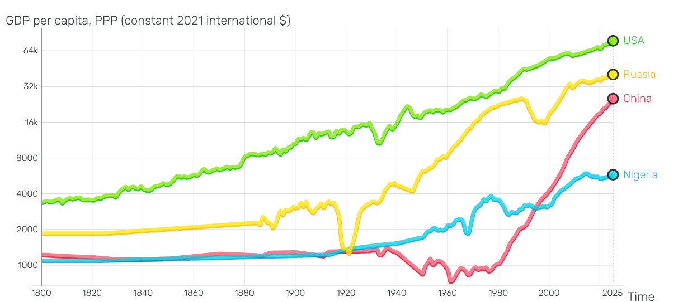
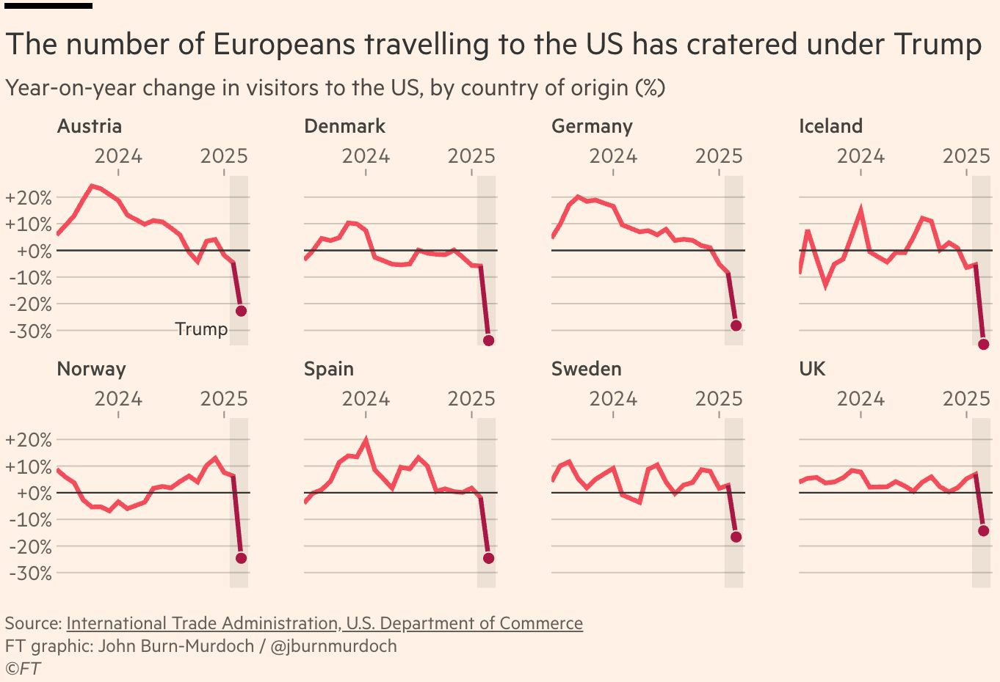

# Introduction

## Learning goals of today

-   Short repetition from last week
-   Some more data viz examples
-   Some more ggplot options

## Repetition: Basic components of ggplot() function

-   call function: ggplot(...
-   add data: data = ...
-   add aesthetics aes(x = ... , y = ... , color = ...)
-   add layer that you want to visualise, like points + geom_point()

## Repitition: Simple example of ggplot() - Code

```{r}
# Load ggplot2
library(ggplot2)

# Scatterplot using iris data set
ggplot(data = iris,
       mapping =
         aes(x = Sepal.Length,
           y = Sepal.Width,
           colour = Species)) +
  geom_point()

```

## Other important things to remember

-   ggpplot() usually requires long, tidy data
-   Meaning information you want to diplay need to be stored in one separate variables, not many separate variables

## What additional things today?

- Hihglighting additional variable using colour and shapes
- Separate out by additional variable using faceting

# Additional variable in ggplot()

## Great example: Colour

{fig-align="left" height=250}
 Source: www.gapminder.org


## Options for additional variable

-   There are many ways to include additional variable into graph
-   *colour* / *fill*
-   *size*
- *shape*
- *alpha*
-   *facet_wrap() / facet_grid()*
-   ...

## *colour* / *fill*

-   Adding *colour* or *fill* adds colour to graph
- lines and strokes (e.g. geom_point()/ geom_line()) --> *colour*
- inside areas (e.g. geom_bar()/ geom_hist()) --> *fill*
-   Colours depend on input variable (factor vs. continuous)

## *colour* (factor): Example code

```{r}
# Load ggplot2
library(ggplot2)

# Scatterplot using iris data set with colour
ggplot(data = iris,
       mapping =
         aes(x = Sepal.Length,
           y = Sepal.Width,
           colour = Species)) +
  geom_point()

```

## *colour* (factor): Example image

```{r}
#| echo: FALSE
#| eval: TRUE
#| fig.width: 6
#| fig.asp: 0.618


# Load ggplot2
library(ggplot2)

# Scatterplot using iris data set with colour
ggplot(data = iris,
       mapping =
         aes(x = Sepal.Length,
           y = Sepal.Width,
           colour = Species)) +
  geom_point()

```

## *colour* (continuous): Example code

```{r}
# Load ggplot2
library(ggplot2)

# Scatterplot using iris data set with colour (continuous)
ggplot(data = iris,
       mapping =
         aes(x = Sepal.Length,
           y = Sepal.Width,
           colour = Petal.Width)) +
  geom_point()

```

## *colour* (continuous): Example image

```{r}
#| echo: FALSE
#| eval: TRUE
#| fig.width: 6
#| fig.asp: 0.618


# Load ggplot2
library(ggplot2)

# Scatterplot using iris data set with colour (continuous)
ggplot(data = iris,
       mapping =
         aes(x = Sepal.Length,
           y = Sepal.Width,
           colour = Petal.Width)) +
  geom_point()

```

## *fill* (factor): Example code

```{r}
# Load ggplot2
library(ggplot2)

# Bar plot using iris data set with fill
ggplot(data = iris,
       mapping =
         aes(x = Sepal.Length,
           fill = Species)) +
  geom_bar()

```

## *fill* (factor): Example image

```{r}
#| echo: FALSE
#| eval: TRUE
#| fig.width: 6
#| fig.asp: 0.618


# Load ggplot2
library(ggplot2)

# Bar plot using iris data set with fill
ggplot(data = iris,
       mapping =
         aes(x = Sepal.Length,
           fill = Species)) +
  geom_bar()

```


## Exercise: Create three colour graphs with your data

- Create one graph using fill (factor)
- Create one graph using colour (factor)
- Create one graph using fill or colour (continuous)


## *size*

- for geom_point(), adding *size* changes size of points
- Can be useful to highlight larger weights of individual points (e.g. country population)

## *size*: Example code

```{r}
# Load ggplot2
library(ggplot2)

# Scatterplot using iris data set with size
ggplot(data = iris,
       mapping =
         aes(x = Sepal.Length,
           y = Sepal.Width,
           size = Petal.Width)) +
  geom_point()

```

## *size*: Example image

```{r}
#| echo: FALSE
#| eval: TRUE
#| fig.width: 6
#| fig.asp: 0.618


# Load ggplot2
library(ggplot2)

# Scatterplot using iris data set with size
ggplot(data = iris,
       mapping =
         aes(x = Sepal.Length,
           y = Sepal.Width,
           size = Petal.Width)) +
  geom_point()

```

## *shape*

- for geom_point(), adding *shape* changes shape of points
- Can be useful to visually highlight different sub-divisions in data
- Originally more useful for black and white applications, nowadays colours used more regularly

## *shape*: Example code

```{r}
# Load ggplot2
library(ggplot2)

# Scatterplot using iris data set with shapes
ggplot(data = iris,
       mapping =
         aes(x = Sepal.Length,
           y = Sepal.Width,
           shape = Species)) +
  geom_point()

```

## *shape*: Example image

```{r}
#| echo: FALSE
#| eval: TRUE
#| fig.width: 6
#| fig.asp: 0.618


# Load ggplot2
library(ggplot2)

# Scatterplot using iris data set with size
ggplot(data = iris,
       mapping =
         aes(x = Sepal.Length,
           y = Sepal.Width,
           shape = Species)) +
  geom_point()

```

## Combining options *colour* and *shape*

- Of course, one can also combine options
- may increase visibility of differences even more

## *colour* + *shape*: Example code

```{r}
# Load ggplot2
library(ggplot2)

# Scatterplot using iris data set with colour and shapes
ggplot(data = iris,
       mapping =
         aes(x = Sepal.Length,
           y = Sepal.Width,
           colour = Species,
           shape = Species)) +
  geom_point()

```

## *colour* + *shape*: Example image

```{r}
#| echo: FALSE
#| eval: TRUE
#| fig.width: 6
#| fig.asp: 0.618


# Load ggplot2
library(ggplot2)

# Scatterplot using iris data set with colour and shapes
ggplot(data = iris,
       mapping =
         aes(x = Sepal.Length,
           y = Sepal.Width,
           colour = Species,
           shape = Species)) +
  geom_point()

```


## *alpha*

- *alpha* sets the opacity of information
- Can be useful to visually highlight different sub-divisions in data
- Originally more useful for black and white applications, nowadays colours used more regularly
- Remember the bar plot from before?

## *fill* (factor): Example code

```{r}
# Load ggplot2
library(ggplot2)

# Bar plot using iris data set with fill
ggplot(data = iris,
       mapping =
         aes(x = Sepal.Length,
           fill = Species)) +
  geom_bar()

```

## *fill* (factor): Example image

```{r}
#| echo: FALSE
#| eval: TRUE
#| fig.width: 6
#| fig.asp: 0.618


# Load ggplot2
library(ggplot2)

# Bar plot using iris data set with fill
ggplot(data = iris,
       mapping =
         aes(x = Sepal.Length,
           fill = Species)) +
  geom_bar()

```

## *fill* (density): Example code

```{r}
# Load ggplot2
library(ggplot2)

# Density plot using iris data set with fill
ggplot(data = iris,
       mapping =
         aes(x = Sepal.Length,
           fill = Species)) +
  geom_density()

```

## *fill* (density): Example image

```{r}
#| echo: FALSE
#| eval: TRUE
#| fig.width: 6
#| fig.asp: 0.618


# Load ggplot2
library(ggplot2)

# Density plot using iris data set with fill
ggplot(data = iris,
       mapping =
         aes(x = Sepal.Length,
           fill = Species)) +
  geom_density()

```

## *fill* (density) + *alpha*: Example code

```{r}
# Load ggplot2
library(ggplot2)

# Density plot using iris data set with fill and alpha
ggplot(data = iris,
       mapping =
         aes(x = Sepal.Length,
           fill = Species,
           position = "identity",
           alpha = 0.5)) +
  geom_density()

```

## *fill* (density) + *alpha*: Example image

```{r}
#| echo: FALSE
#| eval: TRUE
#| fig.width: 6
#| fig.asp: 0.618


# Load ggplot2
library(ggplot2)

# Density plot using iris data set with fill and alpha
ggplot(data = iris,
       mapping =
         aes(x = Sepal.Length,
           fill = Species,
           alpha = 0.5)) +
  geom_density()

```

## *alpha* as variable

- Of course, *alpha* can also be used with variable
- Though use case less obvious


## *alpha*: Example code

```{r}
# Load ggplot2
library(ggplot2)

# Scatterplot using iris data set with shapes
ggplot(data = iris,
       mapping =
         aes(x = Sepal.Length,
           y = Sepal.Width,
           alpha = Petal.Width)) +
  geom_point()

```

## *alpha*: Example image

```{r}
#| echo: FALSE
#| eval: TRUE
#| fig.width: 6
#| fig.asp: 0.618


# Load ggplot2
library(ggplot2)

# Scatterplot using iris data set with size
ggplot(data = iris,
       mapping =
         aes(x = Sepal.Length,
           y = Sepal.Width,
           alpha = Petal.Width)) +
  geom_point()

```

## Exercise: Create three graphs with your data

- Create one graph using *size*
- Create one graph using *shape*and *colour*
- Create a density plot with *fill* and *alpha*
- Consider using different variables than in the last exercise

## *alpha*: Example code

```{r}
# Load ggplot2
library(ggplot2)

# Scatterplot using iris data set with size
ggplot(data = iris,
       mapping =
         aes(x = Sepal.Length,
           y = Sepal.Width,
           alpha = Petal.Width)) +
  geom_point()

```

## *alpha*: Example image

```{r}
#| echo: FALSE
#| eval: TRUE
#| fig.width: 6
#| fig.asp: 0.618


# Load ggplot2
library(ggplot2)

# Scatterplot using iris data set with size
ggplot(data = iris,
       mapping =
         aes(x = Sepal.Length,
           y = Sepal.Width,
           alpha = Petal.Width)) +
  geom_point()

```

## Great example: Faceting

{fig-align="left" height=250}

Source: www.ft.com
 
## *facet_wrap()* / *face_grid()*

- faceting is super useful, especially with large data sets
- Creates separate graph per sub-group (hence requires factor variable)
- *facet_wrap(~ x)* <- best to use with one factor variable (x), plots separate graphs per factor
- *facet_grid(x ~ y)* <- best to use with two factor variables (x, y), plots grid of all combinations of x and y

## *facet_wrap()*: Example code

```{r}
# Load ggplot2
library(ggplot2)

# Scatterplot using iris data set with facet_wrap()
ggplot(data = iris,
       mapping =
         aes(x = Sepal.Length,
           y = Sepal.Width)) +
  geom_point() +
  facet_wrap(~ Species)

```

## *facet_wrap()*: Example image

```{r}
#| echo: FALSE
#| eval: TRUE
#| fig.width: 6
#| fig.asp: 0.618


# Load ggplot2
library(ggplot2)

# Scatterplot using iris data set with facet_wrap()
ggplot(data = iris,
       mapping =
         aes(x = Sepal.Length,
           y = Sepal.Width)) +
  geom_point() +
  facet_wrap(~ Species)
```

## *facet_grid()*: Example code

```{r}
# Load ggplot2
library(ggplot2)

# Scatterplot using mtcars data set with facet_wrap()
ggplot(data = mtcars,
       mapping =
         aes(x = hp,
           y = mpg)) +
  geom_point() +
  facet_grid(am ~ cyl)

```

## *facet_grid()*: Example image

```{r}
#| echo: FALSE
#| eval: TRUE
#| fig.width: 6
#| fig.asp: 0.618


# Load ggplot2
library(ggplot2)

# Scatterplot using mtcars data set with facet_wrap()
ggplot(data = mtcars,
       mapping =
         aes(x = hp,
           y = mpg)) +
  geom_point() +
  facet_grid(am ~ cyl)
```

## Exercise: Create two graphs with your data

- Create one graph using *facet_wrap*
- Create one graph using *facet_grid()*


## Things to keep in mind

-   Not all ways to integrate third variable work with every geom
-   *colour* and *fill* work with nearly all geoms
-   Otherwise, just try out and see what works (for you)


# Wrapping up

## Which topics to cover?

-   Which topics would you like me to still cover (more)?
-   One suggestions could be Git

# Working on projects
