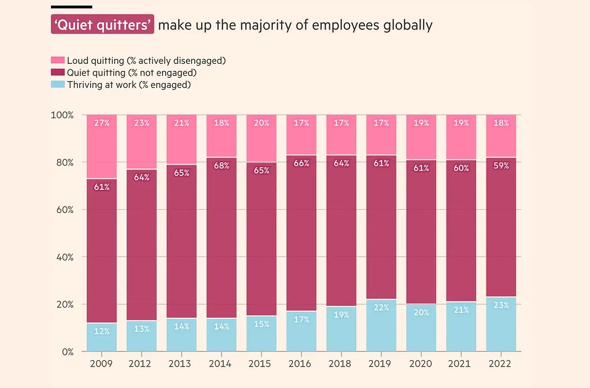

# Introduction

## Learning goals of today

-   Short repetition from last week
-   Even more data viz examples
-   Even more ggplot options

## Repetition: Adding a third variable

-   *colour* / *fill*
-   *size*
-   *shape*
-   *alpha*
-   *facet_wrap() / facet_grid()*
-   ...

## Today we talk about prettyfying graphs

-   Scaling of axes
-   labs(): Labelling
-   theme(): Changing optics

# Using + in ggplot()

## Building graphs bit by bit with +

-   We have used the + before in building graphs
-   Graphs can be saved as objects
-   That means they can be added to later

## How to use the +

1.  Create object
2. assign a base graph in ggplot() to it 
3. Add another additional layer to it using the +


## Running everything in one go (before)

```{r}
#| echo: FALSE
#| eval: TRUE
# Load tidyverse
library(ggplot2)
```

```{r}
# Scatterplot using iris data
ggplot(data = iris,
       mapping =
         aes(x = Sepal.Length,
           y = Sepal.Width,
           colour = Species)) +
  geom_point()
```

## Using + to split up process (after)

```{r}
# Creating iris_plot base
iris_plot <- ggplot(data = iris,
       mapping =
         aes(x = Sepal.Length,
           y = Sepal.Width,
           colour = Species))
# Creating scatterplot by adding geom_point()
iris_scatterplot <- iris_plot + geom_point()
```

## Some additional information

- Name of the objects, as always, up to you
- Can add more than one layer (more than one +)
- Useful for adding potentially multiple geoms, axis limitations and labels

# Scaling of axes

## Scaling the axes

-   Sometimes graphs are too messy so we want to scale
-   one can either adapt data in pre-processing
-   Or one can limit the axes

## Scaling through pre-processing (before)

```{r}
# Scatterplot using iris data, but only below Sepal.Length of 7
ggplot(data = iris,
       mapping =
         aes(x = Sepal.Length,
           y = Sepal.Width,
           colour = Species)) +
  geom_point()

```

## Quick reminder

- We learned that in the tidyverse whatever comes before the pipe becomes first argument of next function
```{r}
# So for example ...
iris_data <- iris |>
  mutate(Sepal.Length = 2 * Sepal.Length)
# ... is identical to 
iris_data <- mutate(iris, Sepal.Length = 2 * Sepal.Length)
```
- Same holds true for ggplot()


## Scaling through pre-processing (after): Code

```{r}
#| echo: FALSE
#| eval: TRUE
# Load tidyverse
library(tidyverse)
```

```{r}
# Scatterplot using iris data, but only Sepal.Length < 7
iris |> # We start off at iris data
  mutate(Sepal.Length = # then mutate() original data
           ifelse( 
             Sepal.Length <=7,
             Sepal.Length,
             NA)) |> 
  ggplot(mapping = # and pipe this into ggplot()
         aes(x = Sepal.Length,
           y = Sepal.Width,
           colour = Species)) +
  geom_point()
```

## Scaling through pre-processing (after): Image

```{r}
#| echo: FALSE
#| eval: TRUE
#| fig.width: 6
#| fig.asp: 0.618
# Scatterplot using iris data, but only below Sepal.Length of 7
iris |> # We start off at iris data
  mutate(Sepal.Length = # then mutate() original data
           ifelse( 
             Sepal.Length <=7,
             Sepal.Length,
             NA)) |> 
  ggplot(mapping = # and pipe this into ggplot()
         aes(x = Sepal.Length,
           y = Sepal.Width,
           colour = Species)) +
  geom_point()

```

## Pros and Cons of pre-processing

-   One actually limits the data "by hand" by oneself
-   Better understanding of data
-   May affect some statistics (like means etc.) in graph

## Alternative: Limiting axes

-   Alternative is adding + xlim() or + ylim() to ggplot()
-   Both lower and upper limits are required, but can be set to NA

## Scaling through xlim() and ylim() (before)

```{r}
# Scatterplot using iris data, but only
# below Sepal.Length of 7
ggplot(data = iris,
       mapping =
         aes(x = Sepal.Length,
           y = Sepal.Width,
           colour = Species)) +
  geom_point()

```

## Scaling through xlim() and ylim() (after): Code

```{r}
# Scatterplot using iris data, but only
# below Sepal.Length of 7
iris |>
  ggplot(mapping =
         aes(x = Sepal.Length,
           y = Sepal.Width,
           colour = Species)) +
  geom_point() +
  xlim(NA, 7)

```

## Scaling through xlim() and ylim() (after): Image

```{r}
#| echo: FALSE
#| eval: TRUE
#| fig.width: 6
#| fig.asp: 0.618

# Scatterplot using iris data, but only
# below Sepal.Length of 7
iris |>
  ggplot(mapping =
         aes(x = Sepal.Length,
           y = Sepal.Width,
           colour = Species)) +
  geom_point() +
  xlim(NA, 7)

```

## Pros and Cons of using xlim() and ylim()

-   Faster, but not always clear how one may limit data
-   May affect some statistics (like means etc.) in graph
-   Use coord_cartesian(xlim, ylim) for just "zooming in" while leaving underlying data intact

# labs(): (Basic) labelling

## Basic labelling

-   Labels are essential for understanding of graph
-   add labels using + labs(x, y, title, subtitle)
-   don't forget to enclose labels in ""

## Great example: Labelling

{fig-align="left" height="250"} Source: www.ft.com

## Creating iris_scatterplot as before


```{r}
# Creating iris_plot base
iris_plot <- ggplot(data = iris,
       mapping =
         aes(x = Sepal.Length,
           y = Sepal.Width,
           colour = Species))
# Creating scatterplot by adding geom_point()
iris_scatterplot <- iris_plot + geom_point()
```


```{r}
#| echo: FALSE
#| eval: TRUE

# Creating iris_plot base
iris_plot <- ggplot(data = iris,
       mapping =
         aes(x = Sepal.Length,
           y = Sepal.Width,
           colour = Species))
# Creating scatterplot by adding geom_point()
iris_scatterplot <- iris_plot + geom_point()
```


## labs(): Example code

```{r}
# Scatterplot using iris data set with labs()
iris_scatterplot +  labs(
    x = "Length of sepals, in cm",
    y = "Width of sepals, in cm",
    colour = "Biological species",
    title = "In plants, sepals length grows with sepal width",
    subtitle = "Selection of three plants"
  )
```

## labs(): Example image

```{r}
#| echo: FALSE
#| eval: TRUE
#| fig.width: 6
#| fig.asp: 0.618
# Scatterplot using iris data set with labs()
iris_scatterplot +  labs(
    x = "Length of sepals, in cm",
    y = "Width of sepals, in cm",
    colour = "Biological species",
    title = "In plants, sepals length grows with sepal width",
    subtitle = "Selection of three plants"
  )

```

## Exercise: Create one graph

-   Re-create a graph from earlier
-   Limit the x and y variables using xlim() and ylim()
-   Add labels to the graph

## To keep in mind

-   These are the "vanilla" ggplot() labelling options
-   Many graphs are built on ggplot(), but are using their own language
-   So some of this may not be applicable, depending on the function you use

# theme()

## What is theme()?

-   themes are ways to effect the colours and positioning of graph elements not related to the data or geoms
-   There are a bunch of standard themes
-   But also everything is customissable

## Standard theme() options

-   there are a bunch of standard themes
-   add them with + theme()
-   overview [here](https://ggplot2.tidyverse.org/reference/ggtheme.html)
- library(ggthemes) provides more cool options


## theme_light(): Example code

```{r}
# Scatterplot using iris data set with theme_light()
iris_scatterplot +
  theme_light()
```

## theme_light(): Example image

```{r}
#| echo: FALSE
#| eval: TRUE
#| fig.width: 6
#| fig.asp: 0.618
# Scatterplot using iris data set with theme_light()
iris_scatterplot +
  theme_light()
```

## Many other things can be changed

- by adding information within + theme(), everything can be changed
- Fonts, colours, axes lines and colours etc.
- too much detail to get into here
- For more information, see [here](https://ggplot2-book.org/themes#modifying-theme-components)

## Exercise: Create one graph with new theme

- download ggthemes
- change the theme of one of your graphs using theme_tufte()
- What are your thoughts on this theme?

# Some additional resources

## Financial Times Visual Vocabulary

[**FT Visual Visual Vocabulary**](https://img1.wsimg.com/blobby/go/18a333ee-9e29-4cc2-a23c-d3147b94d74e/downloads/FT%20Visual-vocabulary.pdf?ver=1668055489691)

Source: [ft.com/vocabulary](ft.com/vocabulary)

## The R Graphics Cookbook

-   Another great source for learning and troubleshooting
-   Has a lot of different standard graphs
-   Provides good solutions to standard problems
-   https://r-graphics.org/


## Wrapping up

- Any remaining questions?
- Working on projects
